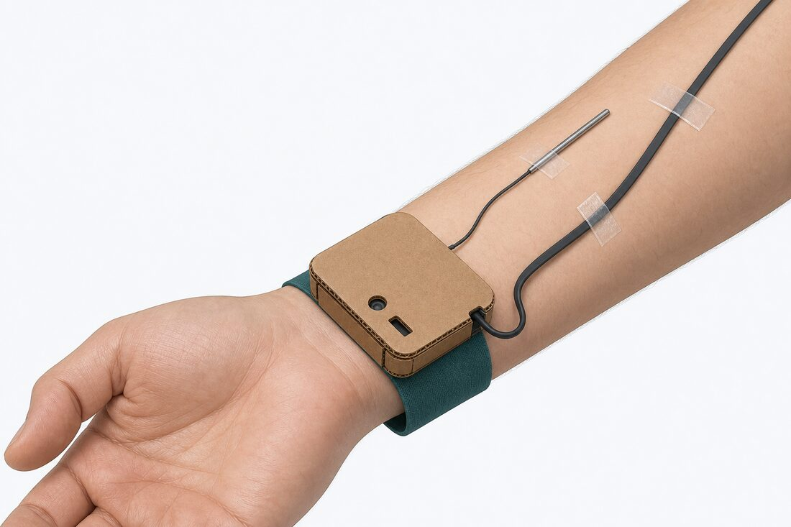
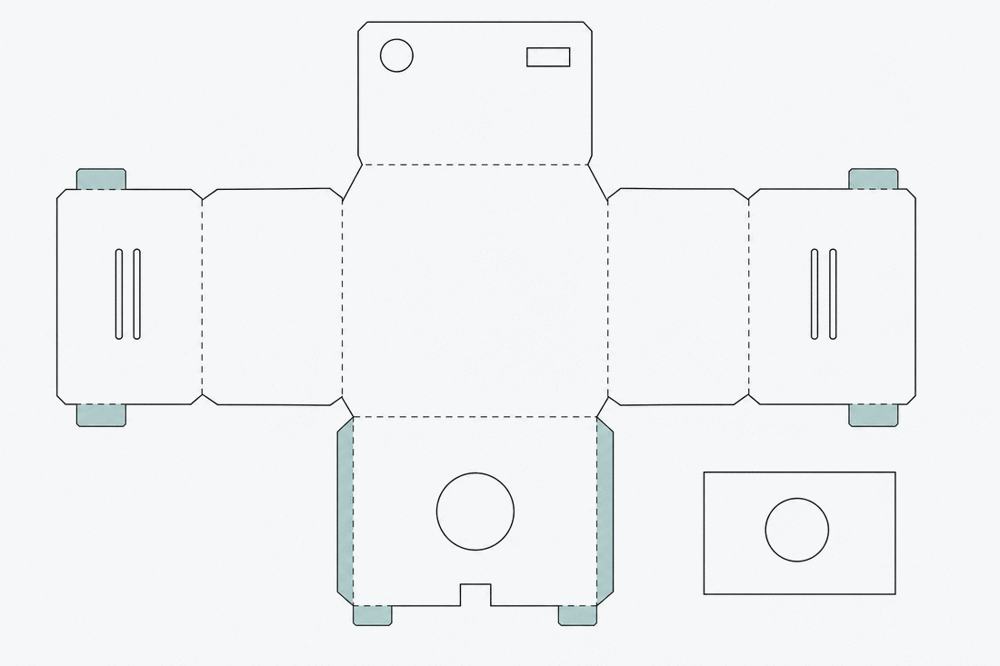
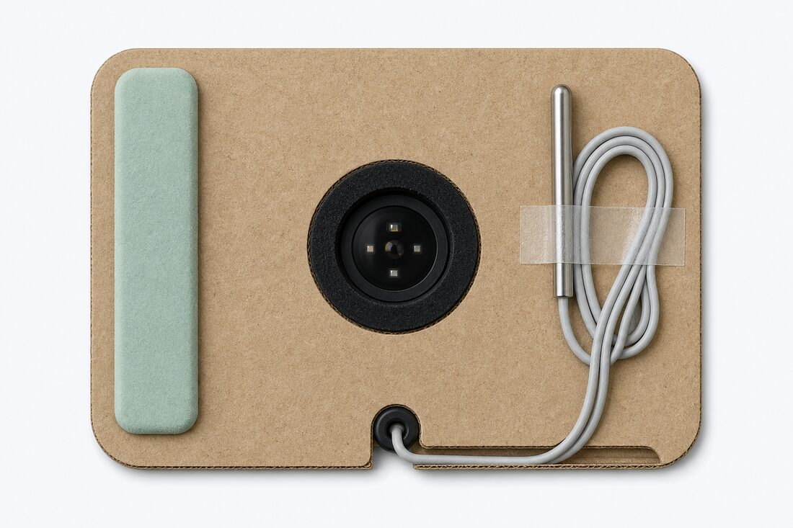
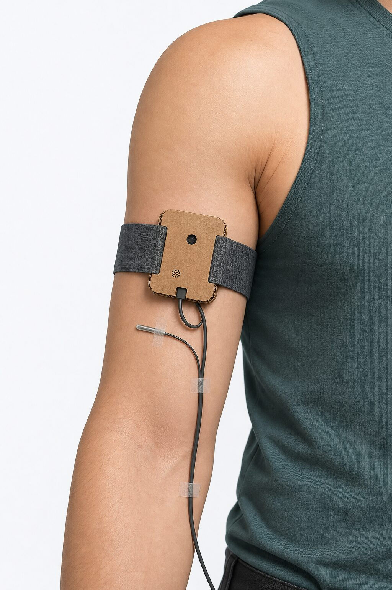
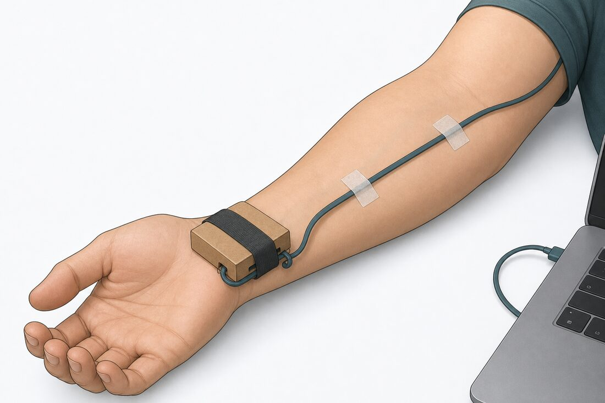
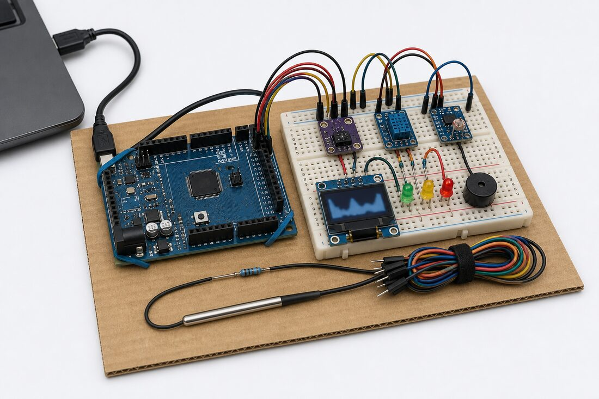

# Cardboard Pod Build — wrist or upper arm

**v1: USB-powered, no battery, no screws, no 3D printing.** Cardboard, tape and two
boards. Worn on the **wrist** or the **upper arm**; the site is recorded per session
(`docs/WEAR_SITES.md`).

> Research prototype. Not a medical device. Not clinically validated.



*Fig 1 — the whole build in use: pod on the inner wrist, DS18B20 probe flat on the
forearm about 20 mm up, everything else held by tape the pod cannot pull on.*

## 1. The three rules

1. **Flat and low.** Board, sensor and cable sit inside 18 mm of cardboard.
2. **Only two things touch skin:** the PPG window and the temperature probe. Everything
   else is padded away so it cannot press.
3. **Nothing can tug the pod.** The probe cable and the USB cable are taped to the limb
   *before* they reach the pod, and a slack loop sits inside the box.

## 2. Parts

| Part | Notes |
|---|---|
| ESP32-S3-DevKitC-1 | USB-C, Wi-Fi, the firmware in `hardware/esp32s3/endo_twin_wearable/` |
| MAX30102 breakout | PPG (IR + red). The only sensor that must sit on skin |
| DS18B20 probe + 4.7 kΩ resistor | Skin temperature, three-wire, pull-up between DQ and 3V3 |
| BH1750 | Ambient light (optional but cheap) |
| BME280 | Environment (optional — under clothing it reads microclimate) |
| Thin corrugated cardboard | 1.5–2 mm, single wall, from any box |
| Kraft paper tape, white glue | Everything structural |
| Thin black foam | Gasket around the PPG window (light seal + pressure relief) |
| 1 mm craft foam | Contact pads on the skin face |
| 20–25 mm elastic strap | Wrist band or upper-arm band, passes through two slots |
| Thin clear medical tape | Probe, USB cable and cable anchors |
| Thin flat USB-C cable | Power **and** data, 1 m is plenty |
| Twist ties, clear shrink or tape | Cable immobilisation and strain relief |

Tools: scissors, craft knife + cutting mat, awl/skewer, ruler, pen, glue stick.



*Fig 2 — cut-and-fold pattern: tray + lid + strap deck, sensor window in the skin
face, notches for the probe and USB cable, slots for the strap.*

## 3. Cut and fold

| Feature | Size | Where |
|---|---|---|
| Pod outer | 60 × 40 × 18 mm | the three images all use this size |
| PPG window | Ø 12 mm | centre of the **skin face** (bottom) |
| Strap slots | 22 × 2 mm, two | opposite long walls |
| Probe notch | 5 × 4 mm | one short wall |
| USB notch | 12 × 5 mm | the other short wall |
| Lid windows | Ø 8 mm light + 4 × Ø 4 mm vents | lid, away from the USB edge |
| Stiffening insert | 56 × 36 mm, Ø 12 mm hole | glued inside the base, holes aligned |
| Skin pads | 2 × (8 × 36 mm) of 1 mm foam | along the long edges of the skin face |

1. Trace the net (Fig 2) on cardboard, cut it out with scissors.
2. Cut the round windows and notches with the craft knife **on a cutting mat**, not in
   your hand.
3. Crease every dashed line: ruler along the line, pull a blunt edge (scissors back) once.
4. Fold the four walls up, glue the corner tabs, drop in the stiffening insert.
5. Clamp with clothes pegs, dry 10 minutes. Test the strap through the slots.
6. Glue the lid last, on three sides only — the USB side stays hinged with kraft tape,
   so you can open the box without cutting it.

## 4. Assemble

1. **Gasket.** Two rings of thin black foam, outer Ø ≈ 20 mm, inner Ø = the PPG window.
   Glue only the outer edge of the ring so the optical path stays clear.
2. **Boards.** Each board gets one strip of kraft tape across each end, taped to the
   cardboard — not glue, so a dead breakout can be replaced.
3. **Probe route.** Run the probe cable along the inside of a wall, out through the
   5 × 4 mm notch, and tie the slack inside with a twist tie so nothing pulls on the
   probe itself.
4. **Probe seat.** Optionally cut a shallow 3 mm channel in the outer skin face and
   recess the probe cable there, so it cannot lift the pod off the skin.
5. **Skin pads.** Glue the two foam strips along the long edges of the skin face — they
   keep the pod level, reduce rocking, and keep the cardboard off the skin elsewhere.
6. **USB.** Thin flat cable out through the 12 × 5 mm notch, a slack loop just inside,
   then taped to the limb further along (Fig 5).
7. **Strap.** Through both slots, snug but not tight. It should not leave a mark after
   30 minutes.



*Fig 3 — the skin face: gasket around the PPG window, probe cable recessed so the pod
sits level, soft pads on the long edges.*

## 5. Where the sensors go (best signal, least discomfort)

### PPG — the part that decides whether this works



*Fig 4 — upper-arm placement: band below the deltoid, pod on bare skin, probe 20 mm
further down the arm.*

- **Wrist:** inner (volar) side, over the artery, **clear of the wrist bone**. Watch-size
  by 5–10 mm; over bone the signal collapses.
- **Upper arm:** on the **inner arm 1–2 cm above the elbow crease**, over the brachial
  artery. Find it with two fingers first: press until you feel the pulse, mark the spot,
  then put the window there.
- **Strap tension:** the gasket must be compressed, the skin must not blanch. If the
  reading drops when you loosen one notch and returns when you tighten it, that notch is
  your setting.
- **Shave or part hair** under the window; a foam gasket cannot seal over it.
- **Warm the site** first (hands/arms cold reduces amplitude), then start the session.
- **Do not wear it over a sleeve.** Fabric is an optical gap; the pod must touch skin.

### Temperature probe

- Same limb as the pod, **20–30 mm away**, lying flat along the limb, not across it.
- On the wrist: further up the forearm (Fig 1). On the upper arm: below the pod, clear of
  the armband and the armpit.
- Tape the **middle** of the probe body only — two tape strips spanning the whole probe
  insulate it from the skin and add lag.
- Keep it off the PPG window and off the strap seam; both create a pressure point.

### Comfort

- Tape every cut cardboard edge; it is the only sharp part of the build.
- Nothing rigid on the far side of the limb — no second board stack.
- The USB cable leaves **toward the elbow or shoulder**, never across the palm, and is
  anchored twice so the laptop moving cannot tug the pod.
- Check after 30 minutes: no red marks, no numbness, pad can be slid slightly by hand.



*Fig 5 — USB power route: out of the notch, slack loop, two tape anchors, then to the
laptop. No battery yet.*

## 6. Does PPG actually detect a pulse on the upper arm?

Yes, it can — but it is the harder site, and it is verifiable in about two minutes.

Evidence: a benchmarking study of out-of-the-lab PPG found the **upper arm** gave
pulse-wave morphology correlation ≈ 0.92 with the finger, and peak-detection sensitivity
and precision of 0.89 [2](https://doi.org/10.3390/s24010214); an earlier
site-comparison study found "arm" recordings analyzable in 83% of cases versus 95% for
the finger and 86% for the volar wrist [5](https://www.frontiersin.org/journals/physiology/articles/10.3389/fphys.2019.00198/full).
The same work reports the **upper arm has the lowest motion-artifact ratio** — its pulse
survives movement better than the wrist or finger — while the amplitude is lower, which
is why gain and a proper light seal matter more here
[3](https://pmc.ncbi.nlm.nih.gov/articles/PMC8073123/).

### Contact test (run it before any real session)

| Step | Watch | Pass |
|---|---|---|
| 1. Pod on the bench, window uncovered | raw IR in the live panel | low/unstable value — the sensor answers at all |
| 2. Window pressed on the site | raw IR | rises clearly and holds steady |
| 3. Pod lifted 1 cm off skin | `status` | "PPG finger absent" sets, HR/HRV blank out |
| 4. Worn normally, arm still, 30 s | HRV appears in the live panel | matches a manual 30-second pulse count within ±5 bpm |

If step 2 or 4 fails:

1. **Move 1–2 cm** along the arm in small steps, re-testing — the artery is not where the
   picture suggests.
2. **Tighten one notch**, then re-test; then try one notch looser to confirm the optimum.
3. **Add a second gasket ring** — daylight leaking under the window is the most common
   cause of a hidden pulse.
4. **Tripod pressure:** press the pod down with one finger — if the pulse appears, the
   strap is not tight enough for this site.
5. **Gain:** the firmware uses LED amplitude `0x24` (≈7 mA) and 4096 nA full scale. If the
   raw IR on the upper arm sits pinned at the top of the range, the ADC is saturating and
   gain must come **down**; if the pulse is there but tiny, raise it. Edit
   `setupPPG()` in `hardware/esp32s3/endo_twin_wearable/endo_twin_wearable.ino`:

   ```cpp
   particleSensor.setup(0x24, 4, 2, 100, 411, 4096);   // default gain; try 0x1F (4 mA) or 0x3F (12.6 mA)
   ```

6. **If the upper arm still refuses** — cold, hairy, fleshy arms can defeat any wrist-grade
   sensor — wear it on the **wrist** for that session. Do not switch site mid-session.

When PPG is unusable the host does the right thing by itself: heart rate, HRV and SpO₂
are withheld (`QUALITY_GATE`), quality drops, and the numbers stay blank instead of being
invented. Nothing about the wear site is hidden: it is recorded with the session and
printed next to the values.

## 7. Bench hub (Mega) — cardboard holds it too

The Mega never goes on the body. Same cardboard approach: one flat sheet as a base plate,
the Mega banded down at two corners, everything else on a breadboard on top.



*Fig 6 — bench rig: Mega on a cardboard base plate, breadboard with sensor breakouts,
OLED, RGB status LEDs, buzzer, probe and bundled jumpers. No mains, no battery.*

Pin map, firmware and relay mode: `MEGA_HUB_BUILD.md`.

## 8. Before you wear it

- [ ] Pod is ≤ 18 mm thick and lies flat on skin
- [ ] PPG window flush, gasket sealing, nothing bridging the optical path
- [ ] Probe flat on skin 20–30 mm from the pod, taped in the middle
- [ ] Both cable routes anchored; pod cannot be moved by either cable
- [ ] Strap removes in one pull, no marks or numbness after 30 minutes
- [ ] Contact test passes (section 6)
- [ ] Calibration: leave it on for the first hour, still, for the baseline window
- [ ] Session site recorded, and the same site used for the whole session

## 9. Add later (optional)

| Addition | Effect |
|---|---|
| Protected Li-ion + regulator | untethered sessions, but adds ~20 mm and 40 g to the pod |
| Second DS18B20 | `temp1` in the frame becomes meaningful |
| Soft pouch instead of cardboard | longer life, same geometry |

Until then the USB cable is the power **and** the data line, so nothing needs to be
charged and nothing leaks charge into a body-worn device.

Wiring below the cardboard, pin by pin: `hardware/WIRING.md`. Wear-site meanings and the
cross-site rule: `WEAR_SITES.md`. Full bench/manual reference: `WEARABLE_AND_MEGA_BUILD_MANUAL.md`.
